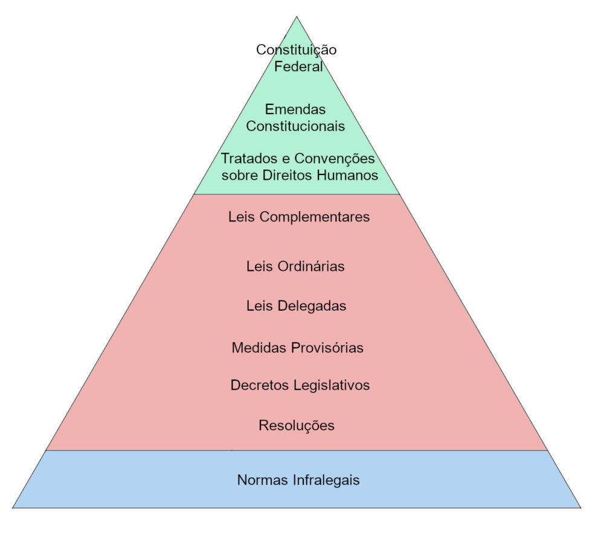

**Direito Constitucional**

## 1. Aspectos gerais do direito constitucional

### 1.1. Direito e juridicidade

Direito é o conjunto de prescrições com que se disciplina e organiza a vida em sociedade.

- **Ubi societas, ibi ius** — onde houver sociedade, lá estará o Direito.
- **Ubi ius, ibi societas** — o Direito reciprocamente pressupõe a sociedade.

**✒️️ Juridicidade**: atributo que distingue a regra de direito das demais regras de comportamento social, funcionando como **fronteira entre o jurídico e o não jurídico** e conferindo **eficácia garantida pelo Estado**.

**📢 Cai em prova:** juridicidade é o que separa a norma jurídica das normas morais, religiosas ou de etiqueta — o critério é a garantia estatal, não o conteúdo.

### 1.2. Norma jurídica: regras e princípios (Robert Alexy)

✒️ **Norma jurídica é o gênero**; regras e princípios são as **espécies**.

|  | **Princípios** | **Regras** |
|---|---|---|
| Natureza | Mandamentos de otimização | Determinações |
| Cumprimento | Em **diferentes graus**, na maior medida possível | **Tudo ou nada** — cumpre-se ou não |
| Limites | Possibilidades **jurídicas e reais** existentes | Âmbito do fático e juridicamente possível |
| Exemplo | Princípio da eficiência | Obrigatoriedade do pagamento do IR |

**📢Memorize a literalidade**: a diferença entre regras e princípios é **QUALITATIVA, e não de grau**. Toda norma é uma regra ou um princípio.

**⚡ Pegadinha clássica:** bancas invertem e afirmam que a distinção seria "de grau" ou "quantitativa". Errado.

**⚡ Ambos (regras e princípios)** dizem **o que deve ser** e podem ser formulados pelas expressões deônticas básicas: **mandamento, permissão e proibição**.

### 1.3. Direito como fenômeno histórico-cultural (José Afonso da Silva)

O Direito é **fenômeno histórico-cultural**, realidade ordenada, ordenação normativa da conduta segundo uma conexão de sentido. É um **sistema normativo**, estudado por unidades estruturais (os ramos da ciência jurídica).

#### 1.4. Posição do Direito Constitucional entre os ramos

✅ De acordo com **José Afonso da Silva**, o Direito divide-se em **Público**, **Social** e **Privado**:

- **Público**: Constitucional, Administrativo, Urbanístico, Econômico, Financeiro, Tributário, Processual, Penal, Internacional (público e privado).
- **Social**: Do Trabalho, Previdenciário.
- **Privado**: Civil, Comercial (empresarial).

**⚠️ Atenção:** essa divisão **não é pacífica na doutrina** — há divergências pontuais entre juristas.

O Direito Constitucional pertence ao **Direito Público**, sendo **Direito Público fundamental**, pois se refere diretamente:

- à organização e funcionamento do Estado;
- à articulação de seus elementos primários;
- ao estabelecimento das bases da estrutura política.

## 2. Conceito e objeto do Direito Constitucional

### 2.1. Conceito (José Afonso da Silva)

Ramo do Direito Público que **expõe, interpreta e sistematiza** os princípios e normas fundamentais do Estado.

Como esses princípios e normas compõem o conteúdo das constituições, o Direito Constitucional é a **ciência positiva das constituições**.

### 2.2. Objeto — Paulo Bonavides

- forma de Estado;
- forma de governo;
- reconhecimento dos direitos individuais;
- estabelecimento de poderes supremos;
- distribuição da competência;
- transmissão e exercício da autoridade;
- formulação dos direitos e garantias individuais e sociais.

### 2.3. Objeto — José Afonso da Silva

Estudo sistemático das normas que integram a constituição do Estado:

- estrutura do Estado e forma de governo;
- modo de aquisição e exercício do poder;
- estabelecimento dos órgãos e limites de sua atuação;
- direitos fundamentais do homem e respectivas garantias;
- regras básicas da ordem econômica e social.

## 3. Conteúdo científico do Direito Constitucional

Do Direito Constitucional surgem **três disciplinas**:

| **Disciplina** | **Objeto** |
|---|---|
| **Positivo (ou Particular)** | Princípios e normas de uma constituição **concreta**, de um Estado determinado (interpretação, sistematização e crítica) |
| **Comparado** | Estudo teórico das normas constitucionais positivas de **vários Estados**, destacando singularidades e contrastes |
| **Geral** | Delineia princípios, conceitos e instituições comuns a vários direitos positivos, classificando-os numa **visão unitária** |

**📢 Fique atento:** **Comparado = cotejo entre países** / **Geral = visão unitária de princípios comuns**. É a troca mais explorada pelas bancas nesse tópico.

**4. Sentidos da Constituição**

**4.1. Sentido Sociológico - Ferdinand Lassalle - Fato Social**

- A Constituição é **fato social**, e não norma jurídica.
- A Constituição Formal do Estado, que seria a positivada, deve espelhar a Constituição real, esta sendo a verdadeira Constituição.
- A Constituição real corresponde à soma dos fatores reais do poder.
- **Fatores reais do poder.** A Constituição real e efetiva é a **soma dos fatores reais de poder** que vigoram na sociedade: forças **econômicas, sociais, políticas e religiosas**. 
- Se a Constituição escrita não refletir esses fatores, ou seja, os fatores reais do poder, ela seria considerada uma mera "folha de papel".
- Havendo conflito entre a Constituição real e a escrita, **prevalece a real (efetiva).**

**⚠️ Atenção:** Consequência lógica cobrada = **todo Estado sempre teve e sempre terá uma constituição rea**l, independentemente de texto escrito. O constitucionalismo apenas criou as constituições escritas. 

**4.2. Sentido Político - Carl Schmitt - Decisão Política Fundamental** 

- A Constituição seria uma **decisão política fundamental**, que visa estruturar e organizar os elementos essenciais do Estado (resultante das forças políticas da sociedade).
- É fruto da **vontade do povo**, titular do poder constituinte → teoria **decisionista ou voluntarista**.
- A validade se baseia na **decisão política que lhe dá existência**, e **não na justiça de suas normas**.
- Pouco importa se corresponde ou não aos fatores reais de poder.

**Constituição x Leis Constitucionais** - para Schmitt:

| **Constituição** | **Leis constitucionais** |
|---|---|
| Matérias de grande relevância jurídica (decisões políticas fundamentais) — ex.: organização do Estado | Normas que integram **formalmente** o texto constitucional, mas de menor importância |
| = normas **materialmente** constitucionais | = normas **formalmente** constitucionais |

**📢 Fique atento:** A concepção política tem correlação direta com a classificação em normas material e formalmente constitucionais — troca frequente nas questões.

**4.3. Sentido Jurídico - Hans Kelsen - Norma Hipotética Fundamental**

- A Constituição seria uma **norma jurídica pura**, sem derivação de aspectos políticos, sociais ou econômicos.
- É norma **superior e fundamental** do Estado: organiza e estrutura o poder político, limita a atuação estatal e estabelece direitos e garantias individuais.
- **Não** retira fundamento de validade dos fatores reais de poder → oposição frontal a Lassalle.
- **Escalonamento hierárquico**: normas inferiores (**fundadas**) retiram validade das superiores (**fundantes**). Decreto ← lei ordinária ← Constituição.

| **Sentido** | **Definição** |
|---|---|
| **Lógico-jurídico** | Constituição como **norma hipotética fundamental** — não real, mas **imaginada/pressuposta**; fundamento lógico-transcendental de validade. Não tem enunciado explícito: equivale à ordem **"Obedeça-se à constituição positiva!"** |
| **Jurídico-positivo** | Constituição como **norma positiva suprema**, que regula a criação de todas as outras. Documento solene, alterável só por procedimento especial (no Brasil, a CF/88) |

**✒️ Pega a dica:** guarde os pares: **fundadas × fundantes**; **pressuposta (hipotética) × posta (positiva)**.

**4.4. Sentido Cultural - Meireles Teixeira - Constituição Total**

- **Constituição Total:** resultado da combinação de todos os sentidos anteriores.
- A Constituição seria a expressão da **cultura** (linguagens, dialetos, práticas religiosas, costumes, valores) de um povo em determinado período.
- O Direito só pode ser entendido como **objeto cultural**, porque **não é**:
    - **real** — os seres reais pertencem à natureza (uma pedra, um rio);
    - **ideal** — não é relação, quantidade ou figura matemática; os seres ideais são imutáveis e existem fora do tempo e do espaço, enquanto o conteúdo das normas varia no tempo, no espaço, entre os povos e na história;
    - **puro valor** — apenas **tenta concretizar** um valor, não se confunde com ele.

Daí o conceito de **Constituição Total**: é **condicionada** pela cultura do povo e, ao mesmo tempo, **condicionante** dessa cultura. Abrange todos os aspectos da vida da sociedade e do Estado, combinando as concepções **sociológica, política e jurídica**.

#### 4.5. Força Normativa da Constituição — Konrad Hesse

A Constituição **é norma jurídica** e possui **força normativa** — tese que se opõe frontalmente a Lassalle.

- Hesse reconhece a importância da realidade histórico-social, mas ela **não é a única condicionante** da Constituição.
- ⚡ Em conflito entre **fato social** e **Constituição**, prevalece a **Constituição** (em Lassalle prevalece o fato social).
- Não há separação, nem confusão, entre **"Constituição real"** e **"Constituição jurídica"**: há **condicionamento mútuo** entre elas, sem que uma dependa pura e simplesmente da outra.
- Quanto mais o conteúdo da Constituição corresponder à natureza do seu tempo (elementos sociais, políticos, econômicos e o "estado espiritual" da época), mais segura será sua força normativa.
- A força normativa depende do conteúdo **e da práxis**, exigindo de todos os partícipes a **vontade de Constituição** (*Wille zur Verfassung*).
- Cabe ao Direito Constitucional evitar que as **questões constitucionais se convertam em questões de poder**.

✅ Para Hesse, a Constituição é a **ordem jurídica fundamental da comunidade**, pois a Lei Fundamental:

1. fixa os **princípios diretores** da formação da unidade política e do desenvolvimento das tarefas estatais;
2. define os **procedimentos de solução de conflitos** no interior da comunidade;
3. disciplina a **organização e o processo de formação** da unidade política e da atuação estatal;
4. cria as **bases e princípios da ordem jurídica global**.

#### 4.6. Constituição Dúctil - Gustavo Zagrebelsky

Também chamada de **maleável** ou **suave**.

- Exprime a necessidade de a Constituição acompanhar a **perda do centro ordenador do Estado** e refletir o **pluralismo** social, político e econômico.
- Cabe à Constituição assegurar apenas as **condições possibilitadoras da vida em comum**, e não realizar diretamente um projeto predeterminado de vida comunitária.
- As Constituições são **plataformas de partida** para políticas constitucionais diferenciadas.

#### 4.7. Concepção Estrutural — José Afonso da Silva

✅ Para José Afonso, as concepções de Lassalle, Schmitt e Kelsen **pecam pela unilateralidade**. Daí a busca por um conceito unitário: a **Constituição Total**.

A Constituição tem:

| **Elemento** | **Conteúdo** |
|---|---|
| **Forma** | Complexo de normas (escritas ou costumeiras) |
| **Conteúdo** | Conduta humana motivada pelas relações sociais (econômicas, políticas, religiosas) |
| **Fim** | Realização dos valores que apontam para o existir da comunidade |
| **Causa criadora e recriadora** | O poder que emana do povo |

**⚠️ Atenção ao homônimo: "Constituição Total"** aparece **duas vezes** na doutrina — em **Meirelles Teixeira** (sentido cultural) e em **José Afonso da Silva** (concepção estrutural).

As bancas *adoram* explorar essa confusão... 🔍

**✒️ Pega a dica:** **Erros clássicos das banca (todos já cobrados, tá? 🧐)**

- Atribuir a **Hesse** a ideia de "folha de papel" → é de **Lassalle**.
- Definir o sentido **sociológico** como "decisão política estruturante" → é o **político (Schmitt)**.
- Dizer que para **Schmitt** a Constituição é o somatório dos fatores reais de poder → é **Lassalle**.
- Atribuir a **Lassalle** a distinção entre Constituição e leis constitucionais → é **Schmitt**.

**2. Estrutura das Constituições**

**2.1. Preâmbulo**

- Explicita os valores que guiaram a elaboração do texto constitucional, possuindo **caráter interpretativo**.
- ⚠️ **Segundo o STF**, o Preâmbulo **não possui eficácia normativa**, ou seja, não tem observância obrigatória.

**2.2. Parte Dogmática**

- Contém os **direitos e deveres** fundamentais.
- Composta pelos **250 artigos da CF**, abarcando normas **materiais** (direitos fundamentais, estrutura de Estado, competências) e **formais** (regras sobre criação de Ministérios e fixação do subsídio de certas autoridades).

**2.3. Disposições Transitórias**

- Normas que garantem a **transição entre um ordenamento e outro**, correspondendo ao **ADCT** na CF/88.
- Podem ser **objeto de controle de constitucionalidade** e modificadas por **reforma constitucional**.

**3. Elementos das Constituições (segundo José Afonso da Silva)**

- **Orgânicos:** regulam a estrutura do Estado e do Poder (exemplo: Título IV - Da Organização dos Poderes).
- **Limitativos:** referem-se aos direitos fundamentais, limitando a ação do Estado (exemplo: Título II - Dos Direitos e Garantias Fundamentais).
- **Socioideológicos:** garantem o bem-estar social (exemplo: Título II - Capítulo II - Dos Direitos Sociais).
- **De Estabilização Constitucional:** defesa do Estado e resolução de conflitos constitucionais (exemplo: Título III - Capítulo VI - Da Intervenção).
- **Formais de Aplicabilidade:** normas que garantem a aplicação da Constituição (exemplo: Preâmbulo).

**4. Classificação das Constituições** *(Este assunto é* ***muito cobrado pelas bancas****. Portanto, precisaremos da* ***sua atenção total*** *agora, ok?)*

**4.1 Classificação quanto à origem**

    - Outorgadas/Ditatoriais - imposta, unilateralmente, por quem está no poder. Não há participação popular.
    - **Democráticas/Promulgadas - com participação popular. Ex: CF/88.**
    - Cesaristas - são outorgadas, mas deve haver ratificação popular através de referendo.
    - Dualistas/pactuadas - acordo entre duas classes para se manterem no poder. Ex: monarquia e burguesia.

**4.2 Classificação quanto à forma**

    - Escritas - documentos solenes.
        - **Escritas Codificadas - único texto codificado. Ex: CF/88.**
        - **Legais - diversos textos legais solenes não aglutinados em um único documento.**
    - Não Escritas - leis esparsas, costumes, acordos, jurisprudência e convenções. *Nas* ***Constituições não-escritas****, há textos escritos, mas que não são documentos solenes, ou seja, não são elaborados através de um processo legislativo.*

**4.3 Classificação quanto ao modo de elaboração**

    - **Dogmáticas** - **Constituições escritas**, de acordo com a ideia de direito de uma determinada época.
        - Dogmáticas Ortodoxas - apenas uma ideologia.
        - **Dogmáticas Heterodoxas - várias ideologias. Ex: CF/88.**
    - Históricas/consuetudinárias - **são Constituições não-escritas**, que foram criadas ao longo de várias épocas.

**4.4 Classificação quanto à estabilidade**

    - Imutável - não podem ser modificadas, são permanentes.
    - Superrígida - há uma parte imutável (ex: cláusulas pétreas), e outra modificável por um processo legislativo especial.
    - **Rígida - possui um processo especial e rigoroso para a modificação, diferente do processo legislativo ordinário.**
    - **Semirrígidas (semiflexíveis) - admitem alteração de parte de seu texto por processo legislativo simples (parte flexível), mas exigem um processo legislativo especial para alteração da outra parte (parte rígida).**
    - Flexível/plástica - alteradas por procedimento legislativo ordinário, não produzem estabilidade constitucional.

✅A **rigidez (ou flexibilidade)** da Constituição decorre tão somente do **processo** exigido para **modificação** do seu texto.

**4. Classificação das Constituições** *(Este assunto é* ***muito cobrado pelas bancas****. Portanto, precisaremos da* ***sua atenção total*** *agora, ok?)*

**4.5 Classificação quanto à conteúdo**

    - Constituição **Material** - apenas as normas que possuem **conteúdos específicos** podem ser consideradas constitucionais. Conteúdos acerca de assuntos essenciais à **estrutura**, à **organização do Estado** e que **estabelecem direitos fundamentais.**
    - Constituição **Formal** - **não importa o conteúdo** das normas, basta que estejam presentes no corpo da Constituição. Ex: **CF/88.**

**✅Todas as normas integrantes da Constituição formal têm o mesmo valor e têm** ***status*** **constitucional. Elas devem ser respeitadas independentemente da natureza de seu conteúdo.** 

**4.6 Classificação quanto à extensão**

    - **Analíticas** - conteúdo extenso, trata de **todas as matérias**, normas apenas formalmente constitucionais. Ex: CF/88.
    - **Sintéticas** - abrangem apenas normas gerais e princípios, com **diretrizes mínimas e materialmente constitucionais**.

**4.7 Classificação quanto à correspondência com a realidade**

    - **Normativas -** contém limites ao poder do Estado. As relações políticas e os agentes políticos subordinam-se a ela. Ex: **CF/88.**
    - **Nominativas** - apesar de conterem limites ao poder estatal, eles não conseguem limitar, de fato, a atividade estatal.
    - **Semânticas** - correspondem a vontade dos detentores do poder.

**4.8 Classificação quanto à função desempenhada**

    - **Constituição-lei** - **status** **de lei ordinária**, **não** vincula o legislador aos seus preceitos, apenas o direciona.
    - **Constituição-fundamento** - possui seu próprio fundamento, cabendo ao legislador apenas dar efetividade, **vincula** o legislador aos seus preceitos.
    - **Constituição-quadro/moldura** - o legislador pode atuar apenas **dentro dos limites impostos** pelo constituinte.

**5. Eficácia e Aplicabilidade das Normas Constitucionais**  **(*****um dos assuntos de maior relevância para nessa atividade*****)**

**5.1 Normas de eficácia plena:**

        - Produzem ou têm possibilidade de produzir **TODOS** os efeitos que o legislador constituinte quis regular;
        - **Autoaplicáveis** e **NÃO** restringível;
        - Aplicabilidade **Direta, Imediata e Integral**;
        - **Eficácia Plena (IDI) => Imediata, Direta e Integral**.

**5.2 Normas de eficácia contida:**

        - Aptas a produzir **TODOS** os seus efeitos, mas **PODEM SER RESTRINGIDAS** pelo poder público;
        - Autoaplicáveis e restringíveis por **Leis, Normas Constitucionais e Conceitos Ético-Jurídicos Indeterminados**;
        - Aplicabilidade **Direta, Imediata e Possivelmente não integral**;
        - **Eficácia Contida (IDNI) => Imediata, Direta e Não Integral**.

**5.3 Normas de eficácia limitada:**

        - **Dependem de regulamentação** futura para produzirem todos os seus efeitos;
        - **NÃO** autoaplicáveis;
        - São divididas em Normas Declaratórias de: **Princípios Institutivos e Princípios Programáticos**;
        - Aplicabilidade **Indireta, Mediata e Reduzida.**
        - **Eficácia Limitada (RIM) => Reduzida, Indireta e Mediata.**

**✅Detalhando mais:**

- Normas de eficácia limitada de **princípio institutivo** dispõem sobre: **organização dos entes, estruturação, criação**. 
- Normas de eficácia limitada de **princípio programático** dispõem sobre: **diretrizes, princípios e programas a serem cumpridos.**
- Normalmente constam os seguintes dizeres: "**conforme dispuser a lei**", "**nos termos da lei**", e outros. Percebam que a **Lei ainda vai ser criada**, por isso a sua eficácia é **limitada**.

**✅Já as normas de eficácia contida, aparecem as seguintes redações: "conforme previsão em lei", "salvo disposição em lei", "nos termos da lei", percebam que há uma certa restrição.**

- **Ex: art. 5˚, XIII, da CF/88 -** "é livre o exercício de qualquer trabalho, ofício ou profissão, atendidas as qualificações profissionais **que a lei estabelecer.**

**🚨Vale reforçar que uma Norma Constitucional pode ter mais de uma aplicabilidade:**

- **Ex: art. 5˚, XLII, da CF/88 -** "a prática do racismo constitui crime inafiançável e imprescritível **(eficácia plena)** sujeito à pena de reclusão, nos termos da lei **(eficácia limitada de. princípio programático)**

**6. Hierarquia das Normas**

Para **Kelsen**, as normas jurídicas são escalonadas de acordo com uma hierarquia. A Constituição seria a **norma fundamental** que submeteria todas as demais normas. Abaixo da Constituição, há as normas superiores, logo depois, as normas inferiores, ambas são denominadas de **normas infraconstitucionais.** As normas de cima são o fundamento de validade das debaixo.

**Norma constitucionais originárias e derivadas** - as normas originárias integram o texto constitucional desde a sua publicação. Já as derivadas, foram incorporadas ao texto constitucional, são as **emendas constitucionais**.

- **A pirâmide representa bem como funciona a hierarquia das normas.**
    - 1ª Normas constitucionais: CF/88, Emendas constitucionais e Tratados internacionais de direitos humanos aprovados pelo quórum das emendas constitucionais;
    - 2ª Normas supralegais: tratados internacionais sobre direitos humanos aprovados pelo rito ordinário;
    - 3ª Normas infraconstitucionais: leis, medidas provisórias, decretos legislativos, resoluções legislativas, tratados internacionais não referente a direitos humanos, decretos autônomos (geram direitos ou deveres).
    - 4ª Normas infralegais: instruções normativas, decretos regulamentares (não geram direitos ou deveres).

https://www.infoescola.com/direito/hierarquia-das-normas/

**✅️Conceitos importantes e recorrentes em provas:**

- **Não há hierarquia** entre normas constitucionais originárias;
- **Não há hierarquia** entre normas constitucionais originárias e constitucionais derivadas;
- **Não existem normas constitucionais originárias inconstitucionais**, por outro lado, as emendas constitucionais podem ser consideradas inconstitucionais.

**✅️Tratados e convenções internacionais sobre direitos humanos**, aprovados pelo rito especial das emendas constitucionais, possuem *status* de emenda constitucional. Os tratados sobre direitos humanos que **não forem aprovados pelo rito especial** serão considerados **normas supralegais.** Portanto, não possuem a mesma forma vinculativa das normas constitucionais, mas ambos devem ser observados pela legislação infraconstitucional.

**✅Mais conceitos importantes e recorrentes em provas:**

- Leis federais, estaduais e municipais possuem o mesmo nível hierárquico;
- Constituição Federal > Constituição Estadual > Lei Orgânica Municipal (há hierarquia);
- Leis Complementares e Leis Ordinárias estão no mesmo nível hierárquico;
- Os regimentos dos Tribunais do Poder Judiciário e os regimentos do Poder Legislativo possuem *status* das Leis Ordinárias.

Saiba que alguns assuntos apenas podem ser abordados por Leis Complementares, a CF/88 elenca tais assuntos, vamos gravar apenas isso, já que será aprofundado em aulas futuras.

**7. Poder Constituinte**

- **Poder Constituinte Originário**
    - Político (poder de fato, extrajurídico, anterior ao Direito)
    - Inicial (inicia nova ordem jurídica)
    - Incondicionado
    - Permanente (não acaba após criar a Constituição, mas fica em "espera" para se manifestar novamente quando for o caso de se criar uma outra Constituição)
    - Ilimitado juridicamente (não encontra limitações em constituições anteriores)
    - Autônomo (liberdade para definir o que haverá na nova Constituição)
- **Quanto ao modo de deliberação:**
    - Concentrado: resulta da deliberação formal de um grupo de agentes, como nas constituições escritas
    - Difuso: resulta de um processo informal, a partir da tradição
- **Quanto ao momento de manifestação:**
    - Histórico (Fundacional): primeira Constituição do Estado.
    - Revolucionário: todas as Constituições posteriores.
- **Quanto ao papel da elaboração do documento constitucional**:
    - Material: valores e ideias, o conteúdo primordial da Constituição.
    - Formal: normas que estruturam, que formalizam as ideias materiais concebidas.

 🚧O examinador poderá **trocar os conceitos das características acima**. Não vamos cair nessas pegadinhas!

- **Poder Constituinte Derivado**
    - Jurídico (regulado pela Constituição)
    - Derivado (deriva do Poder Originário)
    - Limitado (encontra limitações na Constituição)
    - Condicionado

✅O **Poder Constituinte Derivado Decorrente** é o referente à elaboração das Constituições estaduais.

✅O **Poder Constituinte Derivado Reformador** é o referente à modificação da Constituições, como as emendas constitucionais.

✅O **Poder Constituinte Derivado Revisor** é o referente ao artigo 3º do ADCT, este possui sua eficácia exaurida.

*Art. 3º. A revisão constitucional será realizada após cinco anos, contados da promulgação da Constituição, pelo voto da maioria absoluta dos membros do Congresso Nacional, em sessão unicameral*

Veja a tabela resumindo o assunto:

| **Poder Constituinte Derivado Decorrente** | elaboração das Constituições **estaduais**. |
|---|---|
| **Poder Constituinte Derivado Reformador** |  modificação da Constituições, como as **emendas** constitucionais. |
| **Poder Constituinte Derivado Revisor** | artigo 3º do ADCT, este possui sua **eficácia exaurida**. (*Art. 3º. A revisão constitucional será realizada após cinco anos, contados da promulgação da Constituição, pelo voto da maioria absoluta dos membros do Congresso Nacional, em sessão unicameral.)* |
